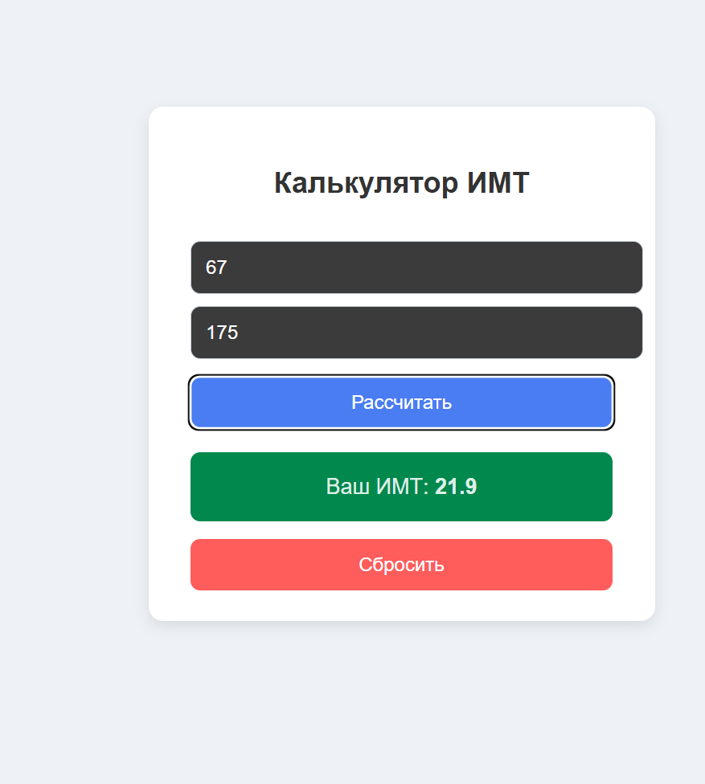
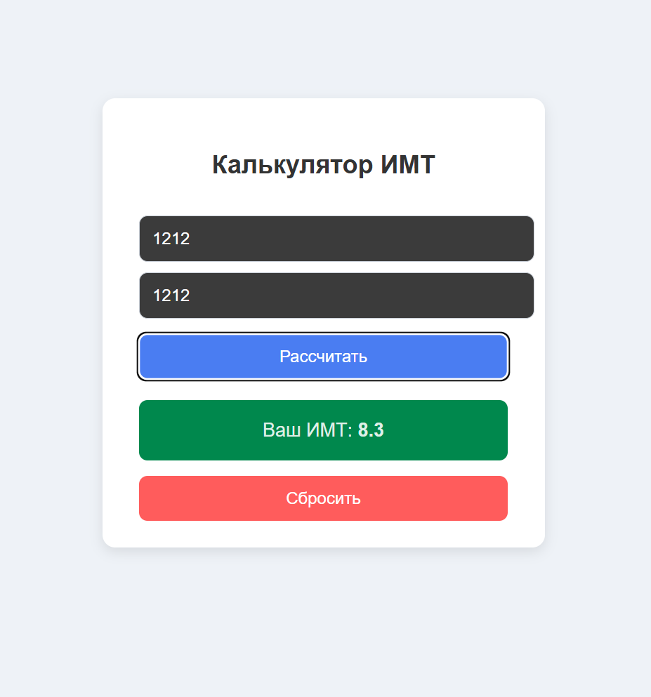

#  Калькулятор ИМТ (BMI Calculator)

Простое React-приложение для расчёта индекса массы тела.  
Пользователь вводит вес и рост, приложение выводит рассчитанный ИМТ.

---

##  Функционал

- Ввод веса (кг)
- Ввод роста (см)
- Кнопка расчёта
- Формула ИМТ: **вес / (рост в метрах)²**
- Отображение результата
- Кнопка "Сброс"

---

##  Технологии

- React  
- JavaScript (ES6+)  
- Vite  
- CSS  

---

##  Скриншоты приложения

### Главный экран







---

##  Запуск проекта

```sh
npm install
npm run dev
